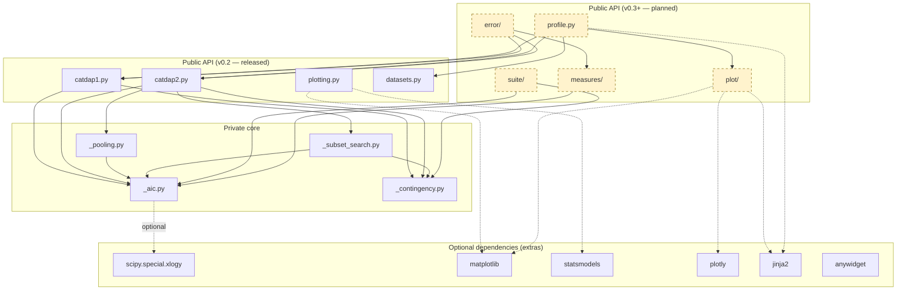
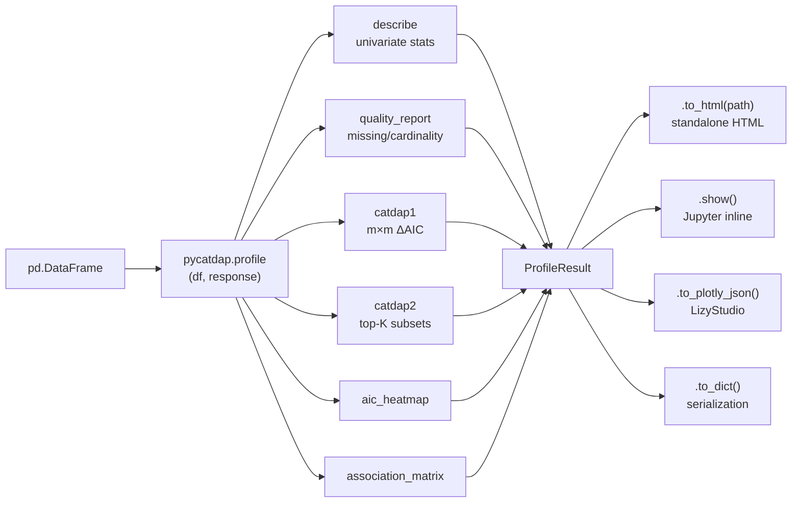
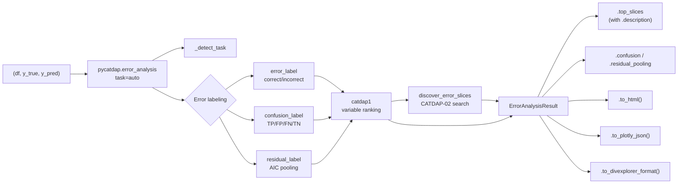
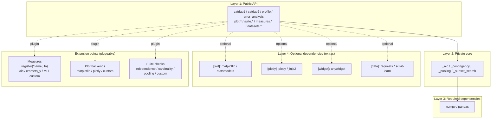
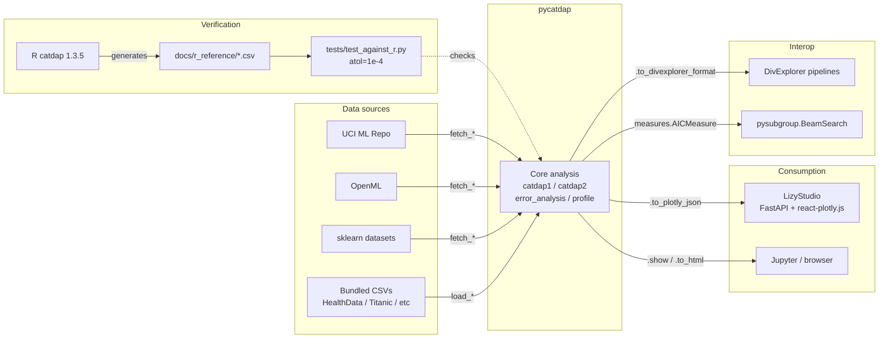

# pycatdap 仕様書 (BLUEPRINT)

> 関連ドキュメント:
> - [HISTORY.md](HISTORY.md) — 仕様変更の Proposal / Decision / Migration
> - [PLAN.md](PLAN.md) — 全体開発計画・リリース計画・Issue マップ
> - [CHANGELOG.md](CHANGELOG.md) — リリース履歴

## 1. 概要

CATDAP（CATegorical Data Analysis Program）は、赤池弘次のAIC（赤池情報量規準）をカテゴリカルデータの分析に適用した手法であり、統計数理研究所の坂元慶行・桂光一により1980年に開発された。現在はRパッケージ（`catdap`）としてのみ公式実装が存在し、Python実装は存在しない。

本計画では、Pythonパッケージ `pycatdap` を以下の用途に対応するライブラリとして開発する（[H-0001](HISTORY.md) 以降）:

1. **CATDAP コア機能**:
   - **CATDAP-01**: 全カテゴリカル変数ペア間の関連度をAICで評価
   - **CATDAP-02**: 指定した目的変数に対する最適な説明変数の部分集合探索（連続変数の最適カテゴリ化を含む）
2. **AIC ベース EDA**(H-0001 / H-0002 以降): ydata-profiling / Skrub / DataExplorer 相当の探索的データ解析
3. **ML 誤差分析**(H-0001 / H-0002 以降): DivExplorer / pysubgroup / Microsoft Error Analysis Tool 相当のスライス発見・コホート分析

---

## 2. 数理的基礎

### 2.1 AIC統計量（分割表モデル）

目的変数 $E$、説明変数 $F$ に対し、分割表の度数を用いたAICは次式で定義される：

$$
AIC(E; F) = -2 \sum_{i,j} n_{EF}(i,j) \ln \frac{n_{EF}(i,j)}{n_F(j)} + 2(C_E - 1) C_F
$$

ここで：
- $n_{EF}(i,j)$: 目的変数のカテゴリ $i$、説明変数のカテゴリ $j$ のクロス度数
- $n_F(j)$: 説明変数のカテゴリ $j$ の周辺度数
- $C_E$: 目的変数のカテゴリ数
- $C_F$: 説明変数のカテゴリ数

### 2.2 ベースAIC（説明変数なしモデル）

$$
AIC(E; \phi) = -2 \sum_i n_E(i) \ln \frac{n_E(i)}{n} + 2(C_E - 1)
$$

### 2.3 出力AIC値

R版CATDAPに倣い、出力されるAIC値は差分形式とする：

$$
\Delta AIC = AIC(E; F) - AIC(E; \phi)
$$

- $\Delta AIC < 0$ → 説明変数 $F$ は目的変数の説明に有効
- $\Delta AIC \geq 0$ → 説明変数 $F$ は無用

ベースAICも別途出力し、ユーザーが絶対AICを復元できるようにする。

---

## 3. パッケージ構成

```
pycatdap/
├── __init__.py          # 公開API
├── catdap1.py           # CATDAP-01 実装
├── catdap2.py           # CATDAP-02 実装
├── _aic.py              # AIC計算コア（共通モジュール）
├── _pooling.py          # 連続変数のカテゴリ化（プーリング）
├── _subset_search.py    # 最適部分集合探索
├── _contingency.py      # 分割表構築ユーティリティ
├── plotting.py          # 可視化（モザイクプロット・帯グラフ等）
└── datasets.py          # サンプルデータセット
tests/
├── test_catdap1.py
├── test_catdap2.py
├── test_aic.py
├── test_pooling.py
└── test_against_r.py    # R版との結果比較テスト
```

---

## 4. 依存ライブラリ

| ライブラリ | 用途 | 必須/任意 | Extras |
|-----------|------|----------|--------|
| numpy | 数値計算・配列操作 | 必須 | - |
| pandas | DataFrame入出力 | 必須 | - |
| scipy | 組み合わせ列挙・`xlogy` (`itertools` で代替可) | 任意 | - |
| matplotlib | モザイクプロット・帯グラフ | 任意 | `[plot]` |
| statsmodels | モザイクプロット（`graphics.mosaicplot`） | 任意 | `[plot]` |
| plotly | インタラクティブ可視化（LizyStudio 統合用、H-0001） | 任意 | `[plotly]` |
| jinja2 | HTML レポート生成（`profile.to_html()`, H-0001） | 任意 | `[plotly]` |
| anywidget | Jupyter インタラクティブウィジェット（pooling slider 等） | 任意 | `[widget]` |

`pycatdap[all]` で全 extras を一括導入できる。

---

### 3.1 パッケージ構成（v0.3 以降、H-0001/H-0002 で拡張）

```
pycatdap/
├── __init__.py             # 公開API
├── catdap1.py              # CATDAP-01 実装（既存）
├── catdap2.py              # CATDAP-02 実装（既存）
├── _aic.py                 # AIC計算コア（既存）
├── _aic_regression.py      # 連続 target 向け Gaussian 回帰 AIC（H-0005）
├── _target_pair.py         # target × explanatory ペア API（H-0004 + H-0005）
├── _association.py         # 全列ペアの ΔAIC 行列（H-0006 Phase B）
├── _pooling.py             # 連続変数のカテゴリ化（既存）
├── _subset_search.py       # 最適部分集合探索（既存）
├── _contingency.py         # 分割表構築ユーティリティ（既存）
├── datasets.py             # サンプルデータセット（拡張予定）
├── plotting.py             # v0.2 互換 API（既存、matplotlib）
├── plot/                   # v0.3+ 拡張可視化 API（H-0001）
│   ├── matplotlib.py
│   └── plotly.py
├── profile.py              # ワンコール EDA レポート（§5.9, H-0001 / H-0007）
├── quality_report.py       # データ品質スキャン（§5.9, H-0008 PR-D2）
├── target_analysis.py      # target 駆動 ΔAIC ランキング（§5.9, H-0008 PR-D3）
├── _quality.py             # 品質警告ヘルパー（profile / quality_report 共有, H-0008 PR-D1）
├── templates/              # jinja2 HTML テンプレート（H-0007 / H-0008）
│   ├── profile.html.j2
│   ├── quality_report.html.j2
│   ├── target_analysis.html.j2
│   └── suite_result.html.j2
├── error/                  # ML 誤差分析（§5.8, H-0002、Phase G〜L 実装済 v0.7.0〜v0.11.0、Phase M H-0015 v0.12.0）
│   ├── __init__.py         # 公開 API
│   ├── _labels.py          # error_label / confusion_label / multiclass_confusion_label / residual_label / abs_residual_pool / _detect_task（v0.7.0, OvR v0.12.0）
│   ├── analysis.py         # error_analysis() one-call（Phase H, v0.8.0）
│   ├── confusion.py        # plot_confusion 等（Phase I, v0.9.0）
│   ├── residual.py         # residual_plot 等（Phase J, v0.9.0）
│   ├── calibration.py      # calibration_curve 等 + 回帰/multi-class（Phase K v0.10.0 / Phase L v0.11.0 / Phase M reliability plot v0.12.0）
│   ├── _backend.py         # plot backend dispatch 集約（Phase L, v0.11.0）
│   ├── _slice.py           # ErrorSlice / SliceDiscoveryResult（Phase L, v0.11.0）
│   ├── _describe.py        # slice description ビルダ（Phase L, v0.11.0）
│   ├── _enumerate.py       # support 枝刈り列挙（Apriori）（Phase L, v0.11.0）
│   ├── discovery.py        # discover_error_slices（Phase L 分類 v0.11.0 / Phase M 回帰 v0.12.0）
│   └── cohorts.py          # compare_cohorts / detect_drift（Phase L, v0.11.0）
├── suite/                  # CI 統合スイート（§5.10, H-0008 PR-D5、v0.6.0 で実装）
│   ├── __init__.py
│   ├── _base.py            # Check Protocol, CheckResult, SuiteResult
│   ├── _checks.py          # 4 個別 check classes
│   └── _suites.py          # AICIndependenceSuite preset
└── measures/               # Pluggable な関連度指標（§5.11, H-0008 PR-D4、v0.6.0 で実装）
    ├── __init__.py
    ├── _registry.py        # register / get / list_measures
    ├── _aic.py             # ΔAIC measure (compute_delta_aic wrapper)
    ├── _cramers_v.py       # pure-numpy Cramér's V
    └── _mutual_info.py     # pure-numpy mutual information (nats)
```

---

### 3.2 アーキテクチャ図（視覚版）

5つの観点からアーキテクチャを示す。各図は Mermaid 形式で記述されており、GitHub および mkdocs-material 上で自動的にレンダリングされる。

#### A. モジュール依存グラフ



**読み方**: 実線は必須 import、点線は任意依存(extras)経由の利用、黄色破線枠は v0.3 以降に追加予定のモジュール。

#### B. EDA データフロー — `profile()` の経路



**読み方**: 入力 DataFrame から `ProfileResult` が組み立てられ、用途別の表現に変換される。

#### C. ML 誤差分析データフロー — `error_analysis()` の経路



**読み方**: 予測結果は分類か回帰かを判定後、適切な error label に変換され、CATDAP-01/02 のターゲットとして扱われる。

#### D. レイヤと拡張ポイント



**読み方**: 4 つのレイヤで責務を分離し、3 つの拡張ポイントでサードパーティ・ユーザー拡張を受け入れる。

#### E. 統合境界(外部システム連携)



**読み方**: pycatdap は4方向で外部システムと統合する — (1) 検証(R catdap)、(2) 消費(LizyStudio / Notebook)、(3) 相互運用(DivExplorer / pysubgroup)、(4) データ取得(UCI / OpenML / sklearn / 同梱)。

---

## 5. モジュール別詳細設計

### 5.1 `_aic.py` — AIC計算コア

```python
def compute_aic_twoway(
    cross_freq: np.ndarray,   # shape (C_E, C_F)
    marginal_f: np.ndarray,   # shape (C_F,)
) -> float:
    """
    AIC(E; F) を計算する。
    ゼロ度数セルは 0*ln(0) = 0 として扱う。
    """

def compute_base_aic(
    marginal_e: np.ndarray,   # shape (C_E,)
    n: int,                   # 総度数
) -> float:
    """AIC(E; φ) を計算する。"""

def compute_delta_aic(
    cross_freq: np.ndarray,
    marginal_e: np.ndarray,
    marginal_f: np.ndarray,
    n: int,
) -> float:
    """ΔAIC = AIC(E;F) - AIC(E;φ) を計算する。"""
```

**実装上の注意点：**
- `n_EF(i,j) = 0` の場合、`0 * ln(0) = 0` として処理（`np.where` or `xlogy`）
- `scipy.special.xlogy` があれば利用、なければ自前実装
- 数値安定性のためlog計算にはガード条件を入れる

### 5.2 `_contingency.py` — 分割表構築

```python
def build_crosstab(
    data: pd.DataFrame,
    response: str,
    explanatory: str | list[str],
) -> tuple[np.ndarray, np.ndarray, np.ndarray, int]:
    """
    DataFrameから分割表を構築する。
    
    Returns:
        cross_freq: クロス度数表
        marginal_e: 目的変数の周辺度数
        marginal_f: 説明変数の周辺度数
        n: 総度数
    """

def build_multidim_crosstab(
    data: pd.DataFrame,
    response: str,
    explanatory_set: list[str],
) -> tuple[np.ndarray, ...]:
    """多次元分割表を構築する（CATDAP-02用）。"""
```

### 5.3 `_pooling.py` — 連続変数のカテゴリ化

CATDAP-02の重要な機能。連続変数を離散化する2つの方式を実装する。

```python
def equal_pooling(
    values: np.ndarray,
    accuracy: float,
) -> np.ndarray:
    """
    等間隔プーリング（pool=0）。
    accuracy（観測精度）で指定した最小幅で等間隔に分割後、
    トップダウンで隣接区間をAICに基づき統合する。
    """

def unequal_pooling(
    values: np.ndarray,
    accuracy: float,
) -> np.ndarray:
    """
    不等間隔プーリング（pool=1、デフォルト）。
    accuracyで指定した最小幅の区間に分割後、
    ボトムアップで隣接区間をAICに基づき統合する。
    """

def optimal_binning(
    values: np.ndarray,
    response: np.ndarray,
    method: str = 'bottom_up',  # 'top_down' or 'bottom_up'
    accuracy: float = None,
) -> tuple[np.ndarray, list[float]]:
    """
    AIC最小化による最適カテゴリ化のメインルーチン。
    
    Returns:
        categorized: カテゴリ化された値
        boundaries: 区間境界値のリスト
    """
```

**アルゴリズム概要（ボトムアップ法）：**
1. 連続値を `accuracy` の幅で細かい区間に分割
2. 各隣接区間ペアについて、統合した場合のAIC変化量を計算
3. AICが最も減少するペアを統合
4. AICが減少しなくなるまで繰り返す

### 5.4 `_subset_search.py` — 最適部分集合探索

```python
def search_best_subset(
    data: pd.DataFrame,
    response: str,
    explanatory_candidates: list[str],
    max_vars: int = None,
) -> list[SubsetResult]:
    """
    説明変数の最適部分集合を探索する。
    
    手順：
    1. 各単一説明変数のAICを計算しランキング
    2. 上位変数からステップワイズに変数追加
    3. 各ステップで最小AICの組み合わせを記録
    
    Returns:
        AIC昇順にソートされた部分集合のリスト
    """

@dataclass
class SubsetResult:
    variables: list[str]    # 説明変数名
    n_vars: int             # 変数数
    n_categories: int       # 総カテゴリ数
    aic: float              # ΔAIC値
```

**探索アルゴリズム：**
- 単一変数 → 2変数 → ... → k変数と逐次的に探索
- 各段階で、前段階の上位変数を保持しつつ1変数追加
- 計算量を抑えるため `nvar` パラメータで探索対象変数数を制限可能
- R版と同様に、pa1/pa2/pa3 に相当するメモリ制御パラメータを提供

### 5.5 `catdap1.py` — CATDAP-01

```python
def catdap1(
    data: pd.DataFrame,
    response_names: list[str] | None = None,
) -> Catdap1Result:
    """
    全カテゴリカル変数ペア間の関連度をAICで評価する。
    
    Parameters:
        data: カテゴリカル変数のみからなるDataFrame
        response_names: 目的変数名リスト（Noneなら全変数を順に目的変数とする）
    
    Returns:
        Catdap1Result（二元表、AIC値、AIC順位を含む）
    """

@dataclass
class Catdap1Result:
    tway_tables: dict        # 各ペアの二元表
    aic: pd.DataFrame        # 各目的変数に対する説明変数のAIC
    aic_order: dict          # AIC昇順の説明変数リスト
    total: pd.Series         # 各変数の度数とコード
```

### 5.6 `catdap2.py` — CATDAP-02

```python
def catdap2(
    data: pd.DataFrame,
    pool: list[int] | None = None,
    response_name: str = None,
    accuracy: list[float] | None = None,
    nvar: int | None = None,
    additional_output: list[list[str]] | None = None,
) -> Catdap2Result:
    """
    目的変数に対する最適説明変数部分集合を探索する。
    
    Parameters:
        data: DataFrame（カテゴリカル・連続変数混在可）
        pool: 各変数のプーリング方式
              -m: m区間ヒストグラム（目的変数のみ）
               0: 等間隔プーリング（トップダウン）
               1: 不等間隔プーリング（ボトムアップ、デフォルト）
               2: プーリングなし（離散変数）
        response_name: 目的変数名
        accuracy: 各変数の離散化の最小幅
        nvar: 多次元分析に保持する変数数
        additional_output: 追加出力する変数組のリスト
    
    Returns:
        Catdap2Result
    """

@dataclass
class Catdap2Result:
    tway_tables: dict                  # 二元表
    intervals: dict                    # 連続変数の区間境界
    base_aic: float                    # ベースAIC
    aic: pd.DataFrame                  # 単一説明変数のAIC
    aic_order: list                    # AIC昇順の変数リスト
    subsets: list[SubsetResult]        # 部分集合のAICリスト
    contingency_tables: dict | None    # 最良・追加部分集合の分割表
```

### 5.7 `plotting.py` / `plot/` — 可視化（H-0001 で拡張）

**既存（v0.2 互換、matplotlib）**:
```python
def mosaic_plot(table, ax=None, **kwargs): ...
def barplot_twoway(table, ax=None, **kwargs): ...
def aic_comparison_plot(result, response=None, ax=None, **kwargs): ...
```

**新規（v0.3 以降、matplotlib / plotly 両バックエンド）**:
```python
# 単変量
pycatdap.plot_variable(df, col, backend="matplotlib"|"plotly")
pycatdap.plot_missing(df, backend="matplotlib"|"plotly")

# 目的変数 × 説明変数ペア（H-0004、v0.3+ / H-0005 で連続 target 拡張）
pycatdap.target_summary(
    df, target, explanatory,
    bins=None,
    target_bins=None,                # H-0005: continuous target 用 fallback
    criterion="bic",                 # H-0005: aic | aicc | bic
) -> TargetSummary | RegressionTargetSummary
pycatdap.plot_target(df, target, explanatory, kind="auto", bins=None, backend=...)
# kind = "auto" | "stacked" | "mosaic" | "violin" | "box" | "hist"
#       | "scatter" | "bin_means"   ← H-0005 で追加（連続 target 向け）

# 二変量（H-0006 Phase B、v0.4.0 で実装済み）
pycatdap.plot_pair(df, x, y, *, kind="auto", bins=None, backend=...)
# 対称ラッパー。dtype に基づき (target, explanatory) を決定し plot_target に委譲
pycatdap.aic_heatmap(result, *, threshold=0.0, backend=...)
# Catdap1Result または pd.DataFrame を受け取り、diverging colormap（中心 0）で
# m × m ΔAIC ヒートマップを描画。threshold 未満のセルに "*" 注釈
pycatdap.association_matrix(df, *, measure="aic", bins=None, criterion="bic") -> pd.DataFrame
# 全列ペアの ΔAIC 行列（非対称、対角 NaN）。
# v0.4.0 は measure="aic" のみ。cramers_v / mutual_info は H-0007 で別途
pycatdap.association_plot(table, *, threshold=2.0, backend=...)
# vcd assoc(shade=TRUE) 風 Pearson 標準化残差ヒートマップ
# TargetSummary または pd.DataFrame（クロス頻度）を受け取る
# RegressionTargetSummary は TypeError（plot_target(kind="scatter") を推奨）
```

全結果オブジェクトに `.to_plotly_json()` を実装し、LizyStudio など Web フロントが直接消費可能（DP-4）。

#### 5.7.1 `.to_plotly_json()` 契約（DP-4、LizyStudio 消費面、H-0015）

LizyStudio（FastAPI + react-plotly.js）が依存する **バージョン付き data contract**。`tests/contract/test_plotly_json_contract.py` が全結果型で機械検証する。

**戻り形状は 2 種**:

- **FLAT** — 単一 Plotly figure spec `{"data": list, "layout": dict}`。`react-plotly.js` / `plotly.graph_objects.Figure(spec)` が直接消費可能。各 trace は `"type"` を持つ。
  - 該当: `Catdap1Result`、`Catdap2Result`、`DescribeResult`（`describe`）、`TargetSummary`、`RegressionTargetSummary`。
- **SECTIONED** — セクション名→spec のマッピング `{<section_name>: <FLAT-spec または name→FLAT-spec の dict>}`。各セクションのキーは **安定**（always-present + 発火条件つき conditional）。

**SECTIONED 各結果の安定キー**:

| 結果型 | always-present | conditional（発火条件） |
|---|---|---|
| `ProfileResult`（`profile`） | `association_heatmap` | `top_subsets`（`response=` 指定時） |
| `QualityReport`（`quality_report`） | `warnings_table` | — |
| `SuiteResult`（`suite` runner） | `checks_table` | — |
| `TargetAnalysisResult`（`target_analysis`） | `ranking`, `top_summaries` | — |
| `ErrorAnalysisResult`（`error_analysis`） | `feature_ranking`, `top_summaries` | `confusion`（classification のみ。regression は省略） |

`top_summaries` は `dict[col_name → FLAT spec]`（`top_k=0` で空 dict）。ネストした figure spec も FLAT 準拠。

**JSON 安全性（hard requirement）**: 全 spec は `json.dumps(spec, allow_nan=False)` で round-trip する。NaN / ±Inf は RFC 8259 上無効でブラウザの `JSON.parse` を壊すため、非有限値は `None` に置換する（共有ヘルパ `pycatdap._jsonsafe.scalar_to_json`、heatmap z の None 置換と同方針）。

### 5.8 `error/` — ML 誤差分析サブモジュール（H-0002 で追加、Phase M まで実装 v0.12.0）

```python
# 誤差ラベリング（Phase G、v0.7.0 で実装済）
pycatdap.error.error_label(y_true, y_pred) -> pd.Series        # "correct"/"incorrect"
pycatdap.error.confusion_label(y_true, y_pred, *, positive=None) -> pd.Series
                                                                # "TP"/"FP"/"FN"/"TN"（二値のみ。>2 で NotImplementedError）
pycatdap.error.multiclass_confusion_label(y_true, y_pred, *, classes=None) -> Mapping[Any, pd.Series]
                                                                # OvR: クラスごとの TP/FP/FN/TN（H-0015 v0.12.0、二値コア再利用）
pycatdap.error.residual_label(y_true, y_pred, *, method="aic_pool", n_bins=4) -> pd.Series
                                                                # method = "aic_pool"|"quantile"|"equal_width"
pycatdap.error.abs_residual_pool(y_true, y_pred, *, n_bins=4) -> pd.Series
pycatdap.error._detect_task(y_true, y_pred) -> Literal["classification", "regression"]

# 1コール誤差分析（Phase H、H-0011、v0.8.0 で実装済）
pycatdap.error_analysis(
    df, y_true, y_pred,
    *,
    task="auto" | "classification" | "regression",
    top_k=5,
    positive=None,                          # binary classification の positive class
    residual_method="aic_pool",             # 回帰時の residual_label の method 指定
    n_bins=4,
    bins=None,                              # 説明変数の binning(target_analysis に forward)
    criterion="bic",
) -> ErrorAnalysisResult

# 分類可視化（Phase I、H-0012、v0.9.0 で実装済）
pycatdap.error.plot_confusion(
    y_true, y_pred,
    *,
    labels: list | None = None,
    normalize: Literal["true", "pred", "all"] | None = None,
    backend: Literal["matplotlib", "plotly"] = "matplotlib",
    **kwargs,
) -> Axes | Figure                                  # multi-class 対応
pycatdap.error.plot_confusion_by_slice(
    df, y_true, y_pred, var,
    *,
    labels=None, n_cols=3, normalize="true",
    backend=..., **kwargs,
) -> Figure                                         # H-0012 §F-bis 例外: matplotlib も Figure
pycatdap.error.confusion_aic(y_true, y_pred) -> float
                                                    # ΔAIC、負ほど informative（既存 pycatdap 規約）

# 回帰可視化（Phase J、H-0012、v0.9.0 で実装済）
pycatdap.error.residual_plot(
    y_true, y_pred,
    *,
    kind: Literal["scatter_pred_resid", "scatter_true_pred", "histogram"] = "scatter_pred_resid",
    color_by=None, backend=..., **kwargs,
) -> Axes | Figure
pycatdap.error.residual_by_category(
    df, y_true, y_pred, var,
    *,
    bins: int | None = None,                        # None → AIC 最適 binning
    backend=..., **kwargs,
) -> Axes | Figure
pycatdap.error.residual_pool_plot(
    y_true, y_pred,
    *,
    n_bins=4,
    backend=..., **kwargs,
) -> Axes | Figure                                  # AIC pooling boundary 線オーバーレイ

# Result delegation（Phase I+J、H-0012、v0.9.0 で追加）
result.plot_confusion(*, backend=..., **kwargs)     # binary OR multi-class
result.residual_plot(*, backend=..., **kwargs)      # regression 専用

# キャリブレーション（Phase K、H-0013、v0.10.0 — 二値。回帰/multi-class は Phase L v0.11.0）
pycatdap.error.calibration_curve(
    y_true, y_proba,
    *,
    strategy: Literal["aic", "equal_width", "quantile"] = "aic",  # aic: 確率軸を AIC 最適 binning
    n_bins=10,                                                     # equal_width/quantile 用（aic では無視）
    backend=..., **kwargs,
) -> Axes | Figure                                  # reliability diagram + Wilson 95% CI
pycatdap.error.calibration_table(y_true, y_proba, *, strategy="aic", n_bins=10) -> pd.DataFrame
                                                    # cols: bin_low/bin_high/n/prob_pred/prob_true/ci_low/ci_high
pycatdap.error.brier_score(y_true, y_proba) -> float
pycatdap.error.expected_calibration_error(y_true, y_proba, *, strategy="aic", n_bins=10) -> float
pycatdap.error.maximum_calibration_error(y_true, y_proba, *, strategy="aic", n_bins=10) -> float
result.calibration_curve(*, strategy="aic", n_bins=10, backend=..., **kwargs)  # delegation（二値分類）

# 回帰 / multi-class calibration（Phase L、H-0014、v0.11.0 で実装）
pycatdap.error.regression_calibration_table(y_true, y_pred, *, n_quantiles=10) -> pd.DataFrame
                                                    # cols: bin_low/bin_high/n/pred_mean/actual_mean/ci_low/ci_high
pycatdap.error.regression_calibration_error(y_true, y_pred, *, n_quantiles=10) -> float
pycatdap.error.multiclass_calibration_table(
    y_true, y_proba, *, classes=None, strategy="aic", n_bins=10,
) -> Mapping[Any, pd.DataFrame]                      # one-vs-rest（二値コアを再利用）
pycatdap.error.multiclass_expected_calibration_error(
    y_true, y_proba, *, classes=None, strategy="aic", n_bins=10,
) -> float                                          # macro 平均 OvR ECE

# 回帰 / multi-class calibration reliability plot（Phase M、H-0015、v0.12.0 で追加）
pycatdap.error.regression_calibration_curve(
    y_true, y_pred, *, n_quantiles=10, backend=..., **kwargs,
) -> Axes | Figure                                  # pred_mean × actual_mean + y=x。軸は [0,1] 非クランプ
pycatdap.error.multiclass_calibration_curve(
    y_true, y_proba, *, classes=None, strategy="aic", n_bins=10, backend=..., **kwargs,
) -> Axes | Figure                                  # OvR をクラスごとに [0,1] 正方形へオーバーレイ

# スライス発見・コホート比較・ドリフト（Phase L、H-0014、v0.11.0 で実装）
pycatdap.error.discover_error_slices(
    df, y_true, y_pred,
    *,
    max_vars=3,
    measure="aic" | "cramers_v" | "mutual_info" | callable,  # FR-9 plug-in（measures registry）
    top_k=10,
    min_support=30,                                 # support(Apriori)枝刈り床。ΔAIC ではない
    columns=None,
    n_bins=4,                                       # 回帰のみ: |residual| AIC pooling の初期ビン数
    max_candidates=200_000,                         # 候補数上限ガード。超過で truncated=True + 警告（H-0016）
) -> SliceDiscoveryResult                           # .truncated: 上限到達で打ち切ったか（健全な subset）
# 分類: error_label。回帰（H-0015 v0.12.0、設計 D1）: |y_true-y_pred| を abs_residual_pool で
# AIC binning し、最大平均 |residual| ビンを binary "high_residual" 誤差カテゴリに（2 カテゴリ機構を共有）
pycatdap.error.compare_cohorts(df_a, df_b, *, response=None) -> CohortComparison
pycatdap.error.detect_drift(df_train, df_prod, *, y_true=None, y_pred=None) -> DriftReport
```

**Phase L 枝刈りの設計判断（H-0014 §C、cross-check 済）**: ΔAIC は
`2*(C_E-1)*C_F` のモデル複雑度ペナルティが合成カーディナリティで増えるため
健全な上界を持たない → ΔAIC 枝刈りは真の top-k を取りこぼす。代わりに
**support(スライスサイズ)= anti-monotone(Apriori)** で枝刈りし、
`min_support` 床未満の枝を健全に切る。正当性は
`pruned == exhaustive ∩ {size≥min_support}` の不変条件テストで担保。

#### データクラス契約（v0.8.0 H-0011 で実装、v0.6.1 H-0009 immutable pattern を最初から適用）

```python
@dataclass(frozen=True)
class Slice:
    """単変数(variable, category)スライス。多変数版は ErrorSlice（Phase L）。"""
    variable: str            # 説明変数名
    category: str            # 値 / bin label
    error_category: str      # "incorrect" / "FP" / "FN" / "bin_<i>" 等
    n_in_slice: int          # スライス内サンプル数
    n_error_in_slice: int    # うち error_category のサンプル数
    error_rate: float        # n_error_in_slice / n_in_slice
    pearson_residual: float  # 標準化残差(|2.0| がカットオフ)
    delta_aic: float         # 親変数の ΔAIC

# Phase L（H-0014, v0.11.0）— 多変数スライスと探索結果コンテナ。Slice は無変更で併存
@dataclass(frozen=True)
class ErrorSlice:
    """多変数サブグループ。description は __post_init__ で conditions から導出。"""
    conditions: tuple[tuple[str, str], ...]  # (("age","[60, 78]"),("plan","basic"))
    size: int                # スライス内行数(support)
    error_metric: float      # スライス内 error rate
    delta_aic: float         # 変数 subset の ΔAIC
    measure_value: float     # 選択 measure 値(高いほど interesting、aic は -ΔAIC に正規化)
    n_error_in_slice: int
    description: str          # init=False、conditions から導出（"a ∈ [..] × b = .."）

@dataclass(frozen=True)
class SliceDiscoveryResult:
    slices: tuple[ErrorSlice, ...]   # measure_value 降順
    measure: str
    max_vars: int
    base_aic: float
    n_evaluated: int                 # support 計算した組合せ数
    n_pruned: int                    # 枝刈りで省いた数（>50% 削減の測定可能化）
    label_kind: str
    def to_divexplorer_format(self) -> pd.DataFrame: ...
    def to_dict(self) -> dict: ...

@dataclass(frozen=True)
class CohortComparison:
    summary: pd.DataFrame            # variable / delta_aic / max_abs_diff（delta_aic 昇順）
    distributions: Mapping[str, pd.DataFrame]  # col -> value/prop_a/prop_b/diff
    n_a: int
    n_b: int
    response_delta: pd.DataFrame | None        # response 指定かつ両 cohort に存在時のみ
    def to_html(self, path=None) -> str: ...
    def to_dict(self) -> dict: ...

@dataclass(frozen=True)
class DriftReport:
    drift_ranking: pd.DataFrame      # variable / delta_aic（|delta_aic| 降順）
    n_train: int
    n_prod: int
    error_rate_prod: float | None    # y_true/y_pred 指定時のみ
    def to_dict(self) -> dict: ...

@dataclass(frozen=True)
class ErrorAnalysisResult:
    task: Literal["classification", "regression"]
    label_kind: Literal["error_label", "confusion_label", "residual_label"]
    response_name: str                                       # 内部生成ラベル列名
    feature_ranking: pd.DataFrame                            # numpy buffer frozen
    top_summaries: Mapping[str, TargetSummary]               # MappingProxyType
    top_slices: tuple[Slice, ...]                            # tuple 必須(list 禁止)
    confusion: pd.DataFrame | None                           # 分類のみ、frozen
    residual_pooling: Mapping[str, Any] | None               # 回帰のみ、MappingProxyType
    n_rows: int
    n_correct: int | None
    n_incorrect: int | None
    mae: float | None
    rmse: float | None
    # H-0012 PR-H3 で追加(v0.9.0)。default None なので既存 caller は無影響
    y_true: npt.NDArray[Any] | None = None             # 構築時 numpy buffer frozen
    y_pred: npt.NDArray[Any] | None = None             # 同上

    def show(self) -> None: ...
    def to_html(self, path: str | Path | None = None) -> str: ...
    def to_plotly_json(self) -> dict: ...
    def to_dict(self) -> dict: ...
    def to_divexplorer_format(self) -> pd.DataFrame: ...
    # H-0012 PR-H3 で追加(v0.9.0)
    def plot_confusion(self, *, backend="matplotlib", **kwargs) -> Any: ...
                                                       # binary AND multi-class
                                                       # regression / 不在ラベルで ValueError
    def residual_plot(self, *, backend="matplotlib", **kwargs) -> Any: ...
                                                       # regression 専用
                                                       # classification / 不在ラベルで ValueError
```

実装 safeguards(H-0011 §F、cross-check 2026-05-28 抽出):

- **F-1**: `df` に `__pycatdap_*_label__` 列が既存する場合は明示 `ValueError`
- **F-2**: `confusion` は canonical `["TP", "FP", "FN", "TN"]` 順に reindex
  (`pd.crosstab` が空行を drop する完璧モデル下での KeyError 防止)
- **F-3**: `equal_pooling` boundaries が ascending sort なので
  `bin_0` = under-prediction、`bin_{n-1}` = over-prediction が保証

Phase H スコープアウト → 後続フェーズで解決済:
- 多変数 subgroup discovery → **Phase L `discover_error_slices`（v0.11.0 実装済）**
- 可視化(confusion matrix / residual scatter 等)→ Phase I+J（v0.9.0）
- Calibration(`calibration_curve` / `brier_score` / ECE)→ Phase K（v0.10.0）
- 回帰 / multi-class calibration → **Phase L（v0.11.0 実装済）**、
  reliability-diagram plot → **Phase M `regression_calibration_curve` /
  `multiclass_calibration_curve`（H-0015 v0.12.0 実装済）**
- `confusion_label` multiclass(one-vs-rest)→ **Phase M
  `multiclass_confusion_label`（H-0015 v0.12.0 実装済、二値コア再利用）**。
  `error_analysis` wrapper の multiclass 露出への配線は後続
- 回帰 slice discovery（高残差サブグループ）→ **Phase M `discover_error_slices`
  回帰経路（H-0015 v0.12.0、設計 D1 実装済）**

### 5.9 `profile.py` — ワンコール EDA レポート（H-0001 / H-0007、v0.5.0 で実装）

```python
pycatdap.profile(
    df: pd.DataFrame,
    *,
    response: str | None = None,
    bins: int | None = None,
    criterion: Literal["aic", "aicc", "bic"] = "bic",
    top_k_subsets: int = 5,
    quality_thresholds: dict[str, float] | None = None,
) -> ProfileResult
```

含まれる要素:
- **Overview** — 行数 / 列数 / 欠損率 / 重複行 / メモリ / dtype カウント
- **Quality warnings** — `high_cardinality` / `constant` / `id_candidate` /
  `high_missing` の 4 種類（`quality_thresholds=` で上書き可）
- **Variables** — 列ごとの `VariableCard`（型推定 / カーディナリティ / 欠損 /
  top カテゴリ / 連続統計量 / ΔAIC vs response / AIC binning 境界）
- **Pairwise associations** — 全列ペアの ΔAIC ヒートマップ（H-0006 の
  `association_matrix` 結果）
- **Top subsets** — `response` 指定時のみ `catdap2(nvar=top_k_subsets)` を実行
- **HTML レポート** — jinja2 テンプレート（`src/pycatdap/templates/profile.html.j2`）
  で単一の self-contained HTML を生成、Plotly figure はインライン同梱
  （オフライン閲覧可、Issue #14）

```python
@dataclass(frozen=True)
class ProfileResult:
    overview: dict[str, Any]
    variables: list[VariableCard]
    association: pd.DataFrame
    top_subsets: Catdap2Result | None
    quality_warnings: list[QualityWarning]
    response: str | None
    n_rows: int
    n_cols: int

    def show(self) -> None: ...
    def to_html(self, path: str | Path | None = None) -> str: ...
    def to_dict(self) -> dict[str, Any]: ...
    def to_plotly_json(self) -> dict[str, Any]: ...

@dataclass(frozen=True)
class VariableCard:
    name: str
    kind: str
    n_obs: int
    n_missing: int
    n_unique: int
    top_value: Any
    top_freq: int | None
    stats: dict[str, float] | None
    delta_aic_vs_response: float | None
    intervals: list[float] | None

@dataclass(frozen=True)
class QualityWarning:
    severity: Literal["info", "warning"]
    kind: Literal["high_cardinality", "constant", "id_candidate", "high_missing"]
    column: str
    message: str
    metric: float
```

### 5.10 `suite/` — CI 統合可能なテストスイート（H-0002 + H-0008 PR-D5、v0.6.0 で実装）

deepchecks 風 API。CI/CD パイプラインに `assert` 1 行で組込可能。
全 `Check` は `@dataclass(frozen=True)` で **`eval()` / `exec()` / 文字列 DSL を一切使わない** — 信頼できない DataFrame に対しても安全。

```python
suite = pycatdap.suite.AICIndependenceSuite(df, response="symptoms")
result = suite.run()
assert result.passed, result.summary()
```

含まれる checks:

| Check | severity | response 必須 | デフォルト閾値 |
|---|---|---|---|
| `ConstantColumnCheck` | warning | no | n/a |
| `HighCardinalityCheck` | info | no | `max_categories=50`, `max_ratio=0.5` |
| `IndependenceCheck` | warning | **yes** | `delta_aic_max=0.0` |
| `PoolingSuggestionCheck` | info | **yes** | `min_improvement=5.0`, `fixed_bins=4` |

```python
@dataclass(frozen=True)
class CheckResult:
    name: str
    passed: bool
    severity: Literal["info", "warning"]
    message: str
    metric: float | None
    affected_columns: tuple[str, ...]   # immutable since v0.6.1 (H-0009)

@dataclass(frozen=True)
class SuiteResult:
    suite_name: str
    checks: tuple[CheckResult, ...]     # immutable since v0.6.1 (H-0009)
    n_rows: int
    n_cols: int
    response: str | None

    @property
    def passed(self) -> bool: ...     # warning-severity 失敗時のみ False
    @property
    def failures(self) -> list[CheckResult]: ...   # info も含む全 fail check

    def summary(self) -> str: ...
    def show(self) -> None: ...
    def to_html(self, path: str | Path | None = None) -> str: ...
    def to_dict(self) -> dict[str, Any]: ...
    def to_plotly_json(self) -> dict[str, Any]: ...
```

`SuiteResult.passed` は `"warning"`-severity の check が落ちたときのみ `False`。`"info"`-severity の発見(例: 高カーディナリティ)は advisory にとどまり `passed` を維持する。

### 5.11 `measures/` — Pluggable な関連度指標（H-0002 + H-0008 PR-D4、v0.6.0 で実装）

pysubgroup 互換の interestingness measure 設計（DP-6）。
全 measure は **uniform signature** `Callable[[npt.NDArray[np.float64]], float]` — 2D 分割表を受け取りスカラー association score を返す。

```python
import numpy as np

# 標準提供 measure(分割表 → スカラー)
pycatdap.measures.aic(cross_freq) -> float          # ΔAIC、負ほど informative
pycatdap.measures.cramers_v(cross_freq) -> float    # 0..1、scipy 不要
pycatdap.measures.mutual_info(cross_freq) -> float  # nats, ≥ 0、scipy 不要

# Registry
pycatdap.measures.register("my_measure", fn)
pycatdap.measures.get("my_measure") -> Callable
pycatdap.measures.list_measures() -> list[str]

# association_matrix からの利用
m = pycatdap.association_matrix(df, measure="cramers_v")
m = pycatdap.association_matrix(df, measure="mutual_info")
m = pycatdap.association_matrix(df, measure="my_measure")   # 登録済みなら何でも
```

3 つの標準 measure は import 時に self-register されるので `measures.get("aic")` は追加設定なしで動作する。`unregister` 関数は意図的に提供しない — 名前付き measure の hot-swap は `association_matrix` を非決定的にするため。

`association_matrix` の dispatch:
- `measure="aic"`: 既存の `target_summary` 経由 (continuous response も H-0005 regression AIC で動作)
- それ以外: 両列を `pd.qcut` で binning(NaN は `_missing_` カテゴリに畳む)→ crosstab → measure callable

---

## 6. 公開API設計

```python
import pycatdap

# CATDAP-01: カテゴリカル変数ペアの関連度分析
result1 = pycatdap.catdap1(data, response_names=["Survived"])
print(result1.aic)
print(result1.aic_order)

# CATDAP-02: 最適説明変数部分集合の探索
result2 = pycatdap.catdap2(
    data,
    pool=[2, 2, 2, 0, 0, 0, 0, 2],
    response_name="symptoms",
    accuracy=[0., 0., 0., 1., 1., 1., 0.1, 0.],
)
print(result2.base_aic)
print(result2.aic)
print(result2.subsets)

# 可視化
pycatdap.plot.mosaic(result2)
pycatdap.plot.barplot_twoway(result2, "symptoms", ["age", "ecg"])
pycatdap.plot.aic_comparison(result2)
```

---

## 7. 実装フェーズ計画

### Phase 1: コアAIC計算（推定工数：2日）

- `_aic.py`: AIC計算関数群
- `_contingency.py`: 分割表構築
- 単体テスト（手計算との照合）

### Phase 2: CATDAP-01（推定工数：2日）

- `catdap1.py`: 全変数ペアのAIC計算
- 出力フォーマット整備
- R版の `catdap1()` 結果との照合テスト

### Phase 3: プーリング機能（推定工数：3日）

- `_pooling.py`: 等間隔・不等間隔プーリング
- AIC最小化による最適区間統合
- 連続変数のカテゴリ化テスト

### Phase 4: CATDAP-02（推定工数：4日）

- `_subset_search.py`: 部分集合探索アルゴリズム
- `catdap2.py`: メイン関数統合
- 多次元分割表の構築と評価
- R版 `catdap2()` の HealthData, iris 等での結果照合

### Phase 5: 可視化・パッケージ化（推定工数：2日）

- `plotting.py`: モザイクプロット・帯グラフ・AIC比較
- `datasets.py`: サンプルデータ同梱
- PyPI公開用のパッケージ設定（pyproject.toml）

### Phase 6: テスト・ドキュメント（推定工数：2日）

- `test_against_r.py`: R版出力との体系的比較
- APIドキュメント（docstring + Sphinx）
- チュートリアルnotebook

**合計推定工数: 約15日**

---

## 8. 品質保証：R版との照合テスト戦略

R版CATDAPパッケージとの数値的一致を検証するため、以下のテストデータで結果を比較する。

| テストデータ | 検証内容 |
|-------------|---------|
| HealthData (catdap同梱) | catdap2のAIC値・最適部分集合 |
| Titanic (R同梱) | catdap1/catdap1cの結果 |
| iris (R同梱) | 連続目的変数のプーリング結果 |
| HelloGoodbye (catdap同梱) | 多変数時の部分集合探索 |

照合手順：
1. R側で各テストデータに対しcatdap1/catdap2を実行し、結果をCSVに書き出す
2. Python側で同一データに対し実行し、数値差分を検証
3. 許容誤差: AIC値は小数第4位まで一致（浮動小数点丸め差を許容）

---

## 9. 技術的注意事項

### 9.1 ゼロ度数セルの処理
分割表内にゼロ度数のセルがある場合、$0 \times \ln 0 = 0$ として処理する。
`scipy.special.xlogy(x, y)` は $x=0$ のとき自動的に0を返すため安全に使用可能。

### 9.2 計算量の制御
- CATDAP-02の部分集合探索は変数数に対し組み合わせ爆発を起こすため、`nvar` パラメータで探索対象を制限する
- R版と同様の逐次的探索戦略（ステップワイズ）を採用し、全探索は避ける

### 9.3 欠測値の扱い
- R版の `missingmark` 方式に対応する機能を実装
- 加えて、pandas標準の `NaN` による欠測値ハンドリングも提供

### 9.4 大規模データへの対応
- numpy配列操作を中心に実装し、Pythonループを最小化
- 分割表構築には `pd.crosstab` を活用
- 必要に応じて、プーリングの内部ループをnumbaで高速化する余地を残す