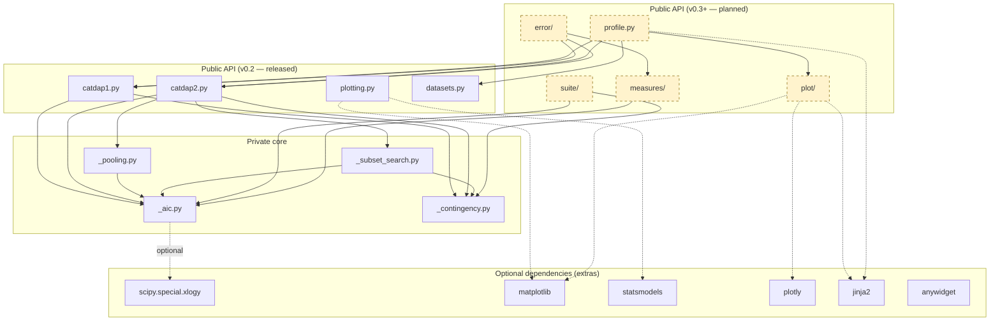
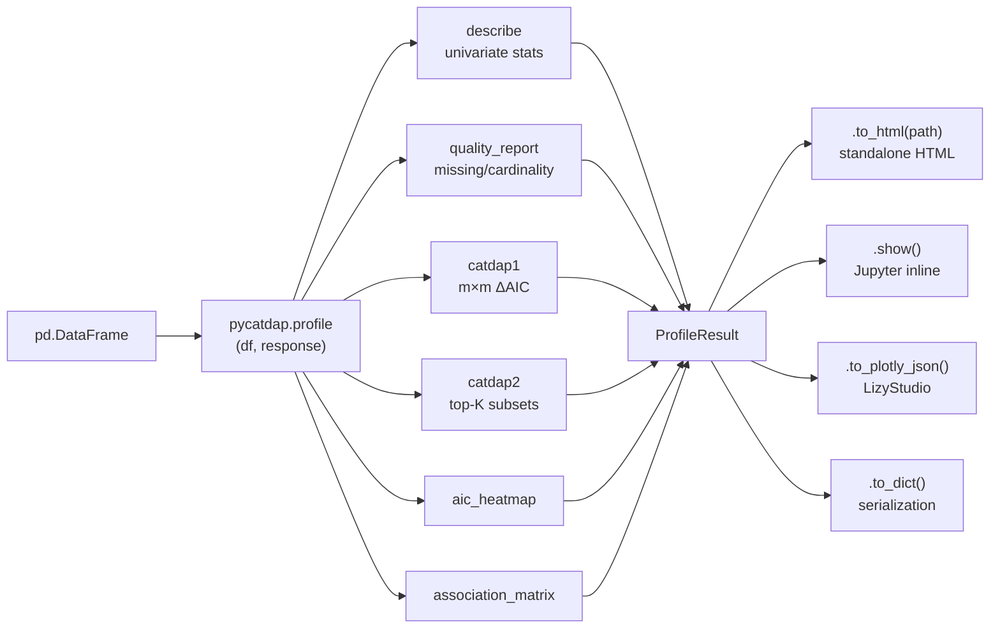
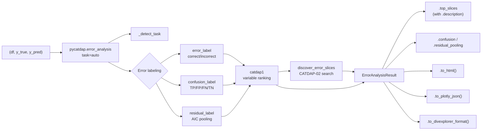
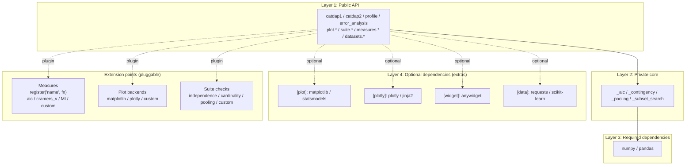
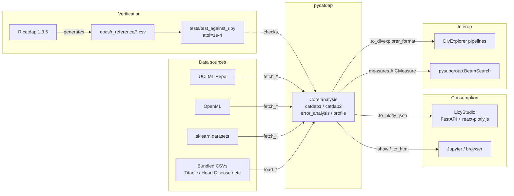

# Architecture

This page presents pycatdap's architecture from five viewpoints, then drills into the file structure and design principles.

## A. Module dependency graph

Which module imports which? Yellow dashed boxes are planned for v0.3+; solid black are released in v0.2.



## B. EDA data flow — what `profile()` does



A `DataFrame` enters, `ProfileResult` is composed from multiple analyses, and outputs branch out for different consumers.

## C. ML error analysis data flow — what `error_analysis()` does



Predictions are detected as classification or regression, converted to categorical error labels, then fed to CATDAP-01/02 as targets.

## D. Layers and extension points



Four layers of responsibility. Three extension points for third parties and users.

## E. Integration boundaries — connections to external systems



pycatdap connects in four directions: (1) verified against R catdap, (2) consumed by LizyStudio / Notebooks, (3) interoperates with DivExplorer / pysubgroup, (4) sources data from UCI / OpenML / sklearn / bundled.

---

## Package structure (textual)

```
pycatdap/
├── __init__.py             # Public API
├── catdap1.py              # CATDAP-01 implementation
├── catdap2.py              # CATDAP-02 implementation
├── _aic.py                 # Core AIC computation
├── _pooling.py             # Continuous variable pooling
├── _subset_search.py       # Best subset search
├── _contingency.py         # Contingency table builder
├── datasets.py             # Sample datasets
├── plotting.py             # v0.2 plotting API (matplotlib)
├── plot/                   # v0.3+ dual-backend plotting (planned)
├── profile.py              # One-call EDA report (planned)
├── error/                  # ML error analysis (planned)
├── suite/                  # CI-integrable test suites (planned)
└── measures/               # Pluggable interestingness measures (planned)
```

## Design principles

From [HISTORY.md H-0002 §G](https://github.com/nbx-liz/pycatdap/blob/main/HISTORY.md):

1. **One-call experience prioritized** — `profile()`, `error_analysis()`
2. **Result objects are explorable** — `.show()`, `.to_html()`, `.to_dict()`, `.to_plotly_json()`
3. **Natural-language slice descriptions mandatory** — `"age ∈ [45, 60] × cholesterol = high"`
4. **Plotly Figure output enabled** — for LizyStudio and other web frontends
5. **Classification + regression both supported by default**
6. **Pluggable measure design** — pysubgroup-compatible
7. **AIC treated as monotonic for pruning** — SliceLine-inspired

## Module boundaries

- `_aic.py`, `_contingency.py`, `_pooling.py`, `_subset_search.py` are **private** numerical primitives — not part of the public API
- `catdap1.py`, `catdap2.py` are **public** classical CATDAP entry points (v0.2)
- `profile.py`, `error/`, `suite/`, `measures/` form the **modern** v0.3+ API surface

## Data classes

All result types follow the same contract:

```python
@dataclass
class SomeResult:
    # Domain-specific fields...

    def show(self) -> None: ...               # Jupyter inline
    def to_html(self, path: str) -> None: ... # Standalone HTML
    def to_plotly_json(self) -> dict: ...     # For web frontends
    def to_dict(self) -> dict: ...            # For serialization
```

This uniformity simplifies LizyStudio integration and downstream consumption.

## Backward compatibility

- v0.2 imports (`pycatdap.plotting.mosaic_plot`, etc.) remain stable through v1.0
- v0.3+ adds new modules; existing modules are not modified
- v1.0 introduces `plot.matplotlib.*` as the canonical path; old paths emit `DeprecationWarning`
- v2.0 may remove deprecated paths

## See also

- [Roadmap](../project/roadmap.md)
- [Tutorials](../tutorials/index.md)
- Canonical specification: [BLUEPRINT.md §3.2](https://github.com/nbx-liz/pycatdap/blob/main/BLUEPRINT.md#32-アーキテクチャ図視覚版) (Japanese)
